## Collection Framework in Java

In almost of real problems, data related to a problem are groups, each group contains many objects A group of objects is called a collection, In Java, a collection framework is introduced. This framework supports tools for managing collections easier.

### Overview of Abstract Data Types

An *abstract data type (ADT)* is a mathematical model for a data type that is determined based on generalization in which data structure, a way for storing data, is omitted. An abstract data type describes a general concept in reality. For example, a collection is an abstract data type.

An abstract data type is defined by its behaviors from the point of view of a user. Programming languages, such as Java, define an ADT as an interface in which a set of behaviors are identified and declared. When an ADT is used, a concrete class implementing appropriate interfaces must be defined. A group of elements can be viewed as in some ways: a list (group of objects in which duplications are allowed), a set ( a group of distinct objects), a map( group of objects in which each object is defined by <Key, Value>). So, all of them are ADTs.

The most common operations are identified in an ADT for a group:

- Add new element.
- Search an element
- Remove an element
- Traverse: A process in which all elements in ADT will be accessed one-by-one.
- Sort elements.

ADT( mathematical model, user view) contrasts with data structure, which is a concrete representation of data (implementer view, physical view).

### Introduction to the Java Collections framework

A collection represents a group of objects, known as its *elements*. Some collections allow duplicate elements and others do not. Some are ordered and others unordered. A collection can contain elements that belong to only one class or some different classes.

Based on collection characteristics, when an ADT is implemented, a specific data structure is chosen and its behaviors will be implemented appropriately.

The Java platform includes a *collections framework*. A collection is an object that represents a group of objects. A collections framework is a unified architecture for representing and manipulating collections, enabling collections to be manipulated independently of implementation details.

**Advantages when a collections framework is used:**

- Reduces programming effort by providing data structures and algorithms so you don't have to write them yourself.
- Increases performance by providing high-performance implementations of data structures and algorithms. Because the various implementations of each interface are interchangeable, programs can be tuned by switching implementations.
- Provides interoperability between unrelated APIs by establishing a common language to pass collections back and forth.
- Reduces the effort required to learn APIs by requiring you to learn multiple ad hoc collection APIs.
- Reduces the effort required to design and implement APIs by not requiring you to produce ad hoc collections APIs.
- Fosters software reuse by providing a standard interface for collections and algorithms with which to manipulate them.

**Basic Collections framework Interface structure**

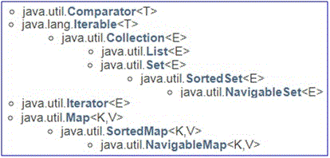

**Collection Implementations**

The general-purpose implementations are summarized in the following table

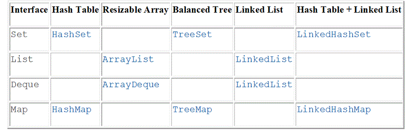

[For more details in Javadoc](https://docs.oracle.com/javase/7/docs/api/java/util/package-tree.html)

### List and the java.util.ArrayList class

All references to elements are stored in a one-dimensional array, called an array list. This organization can be used to store arbitrary elements and they can be duplicated. In the following demonstration, a collection contains six elements: 2 students, 2 integers, 1 table, 1 rectangle.

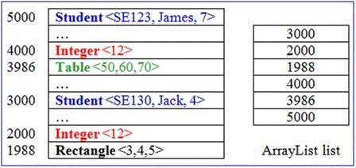

Characteristics of ArrayList

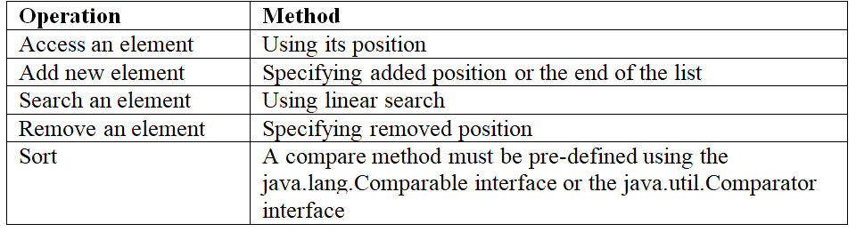

In case of objects in a collection do not belong to the same class, references in a collection will have behaved as referenced to objects of the Object class. Based on OOP inheritance, the following assignment is valid:

*Father_reference = Son_reference;*

[For more details in Javadoc](https://docs.oracle.com/javase/7/docs/api/java/util/ArrayList.html)

**ArrayList Demonstrations**

**Demonstration 1**: Using an ArrayList of arbitrary elements.  
In this demonstration, an empty array-list is initialized then some operations including add/search/ remove and traverse are depicted.

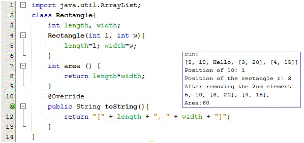

Objects of the Rectangle will be added to ArrayList

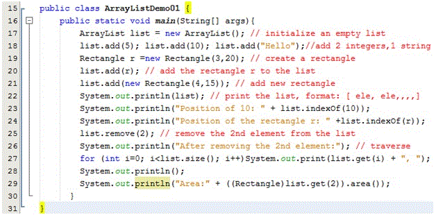

An example for adding arbitrary objects to an ArrayList

**Experiment**

We can not use the method area() for rectangles because all elements of the list have behaved as objects of the Objects class. The Object class does not contain the area() method. If we want to call the area() method for rectangles, class casts must be specified explicitly *(see code line 29)*.

**Demonstration 2**: Using an ArrayList for storing the same-type elements  
an empty array-list is initialized then some objects which belong to the same class are added and some advantages are identified: If the element type is specified, bugs in the code can be detectable at compile time

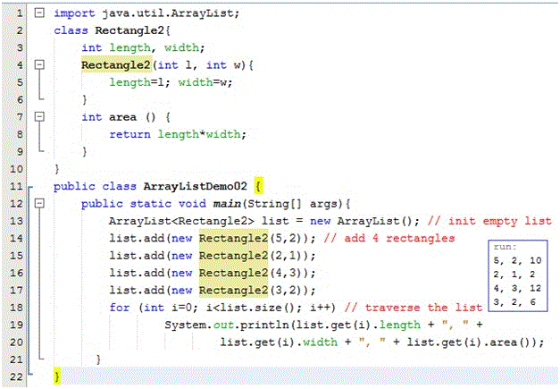

At code line 13, we define the same-type list with class parameter **<Rectangle>**. Then, no class casting is needed because the Java compiler realized the type of elements.

**Demonstration 3**: A demonstration for analyzing, designing, and implementing a program which allows user maintaining a list of the same-type objects.

In this demonstration, ArrayList is used to store a list of students. Student details include:  
Code, name, mark. A menu is supported for user choosing one operation at a time:

1. Add new student  
2. Search a student based on his/her code  
3. Update name and mark of a student based on his/her code  
4. Remove a student based on his/her code  
5. List all students.

**Constraints:**  
Student code must be in format "S000", 0 is a digit.  
Student name can not be blank  
Mark: 0..10

**Analysis**

Concepts | Classes  
--- | ---  
Tool for conditional inputs | Inputter  
Menu | Menu  
Student | Student  
Student list | StudentList  
Program | StudentManager  

**Class Design**

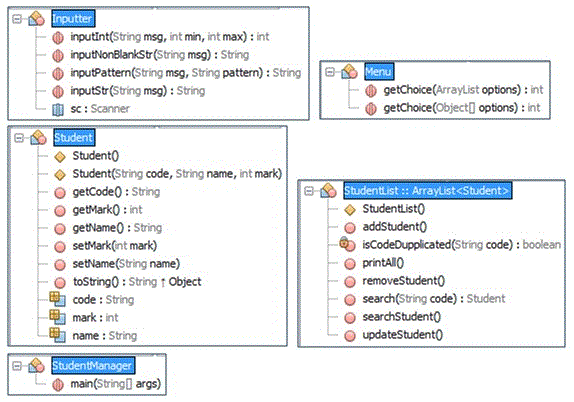

**Algorithms and Sample Code**

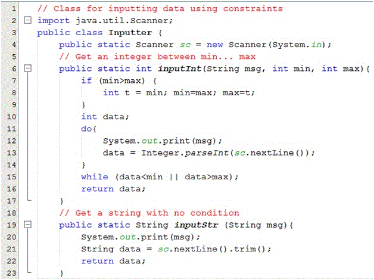  
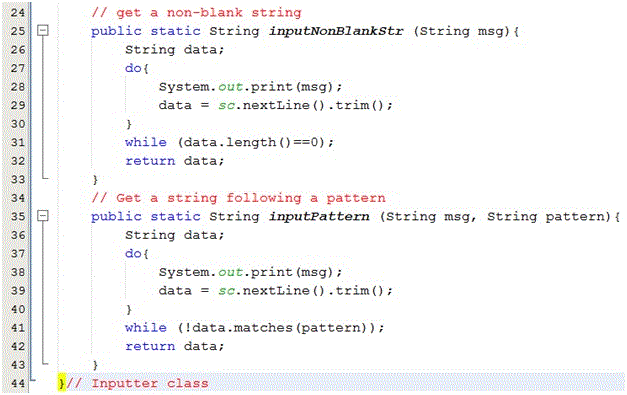  
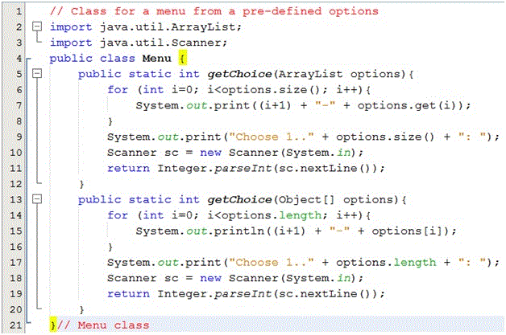  
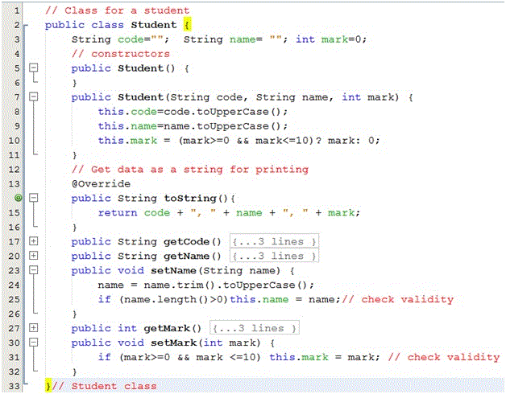  
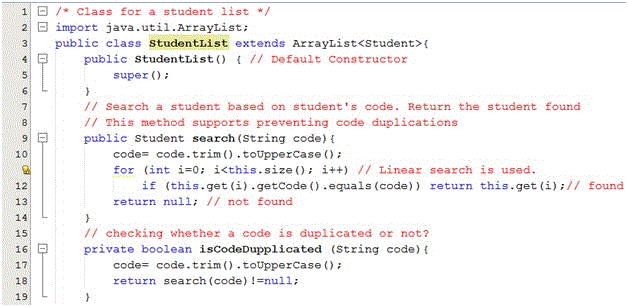  
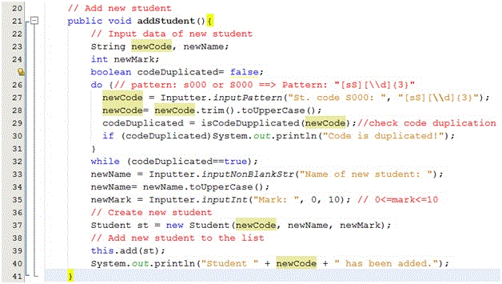  
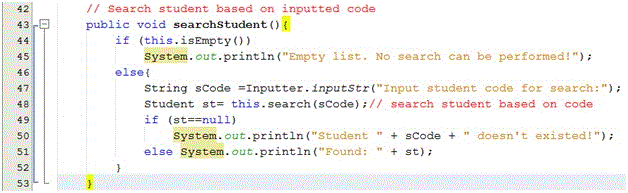  
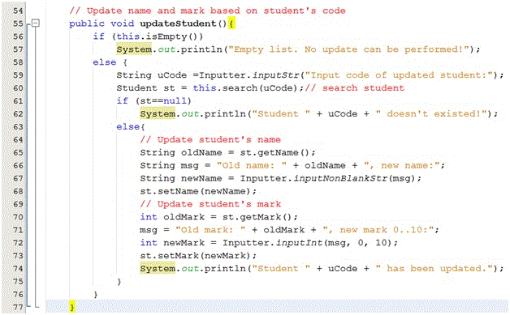  
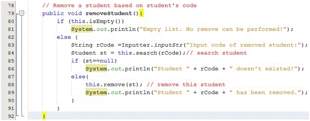  
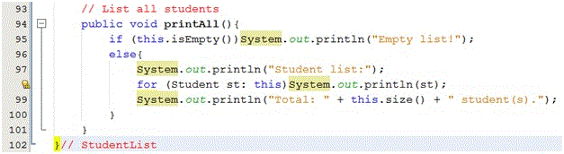  
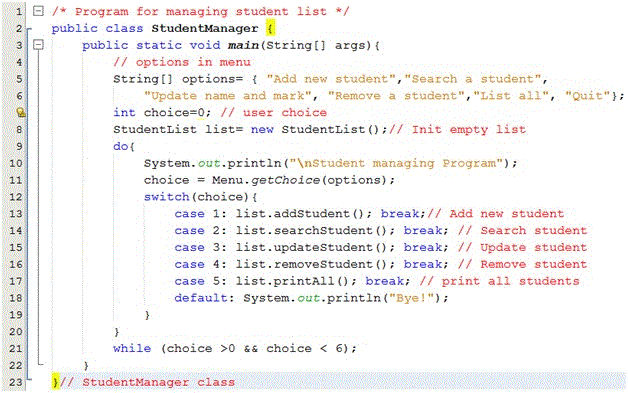

**Test cases**

Run the program, the following menu allows user to choose one operation at a time:

```
Student managing Program
1-Add new student
2-Search a student
3-Update name and mark
4-Remove a student
5-List all
6-Quit
Choose 1..6:
```

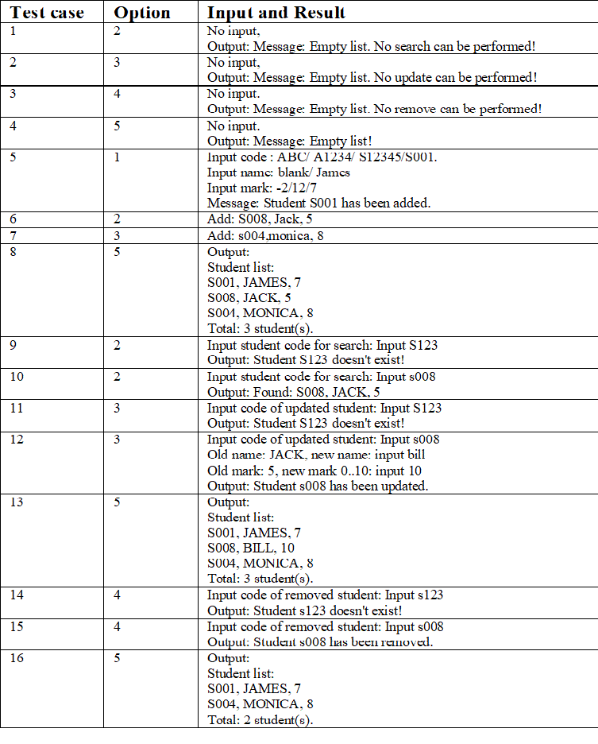

### Set and the java.util.TreeSet class

A set is a group of *distinct objects*. So, duplications are not allowed. A tree is a data type that consists of nodes and arcs (or edges). A tree is depicted upside down with the root (the first node) at the top and the leaves (terminal nodes) at the bottom. An edge describes a father-child relation between two nodes. The upper node is a father, the lower node is a child.

**Note**: Root does not have a father. Leaves do not have children. A node having children is called an intermediate node or non-terminal nodes.

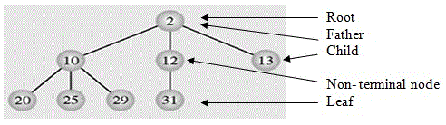

[read more Tree (data structure) in wiki](https://en.wikipedia.org/wiki/Tree_%28data_structure%29#:~:text=A%20tree%20is%20a%20nonlinear%20data%20structure%2C%20compared,root%20and%20zero%20or%20one%20or%20more%20subtrees.)

### Where a TreeSet should be used?

- A sorted group must be maintained.
- Search operation must have high performance

### Introduction to the java.util.TreeSet class

TreeSet is implemented as a [self-balanced ordered tree](https://www.tutorialspoint.com/data_structures_algorithms/avl_tree_algorithm.htm), it is balanced automatically when it becomes an unbalanced state after add and remove operations. So, it guaranteed log(n) time cost for the basic operations (add, remove, and contains).

Note that the ordering maintained by a set (whether or not an explicit comparator is provided) must be consistent with equals if it is to correctly implement the Set interface. This is so because the Set interface is defined in terms of the equals operation, but a TreeSet instance performs all element comparisons using its *compareTo (or compare) method*, so two elements that are deemed *equal* by this method are, from the standpoint of the set, equal. The behavior of a set is well-defined even if its ordering is inconsistent with equals; it just fails to obey the general contract of the Set interface.

[read more TreeSet in Javadoc](https://docs.oracle.com/javase/7/docs/api/java/util/TreeSet.html)

**Demonstration 1**: In this demonstration, the Student class does not implement any comparison method. So, when a TreeSet is used, a compile-time error occurs.

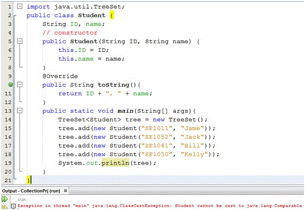

A compile-time error occurs if elements do not implement a comparison method...

**Demonstration 2**:  
In this demonstration, an empty tree set is initialized then add, remove and traverse operations (using Iterator) are performed. Note that, the Integer class implemented the Comparable interface, and duplications are not allowed.

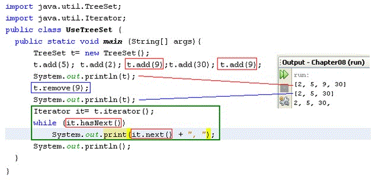

A tree set of integers

**Demonstration 3:**  
In this demonstration, a TreeSet of user-defined objects (Student) are used and basic operations including adding, searching, removing, ascending traversal, descending traversal are performed.

A TreeSet of students

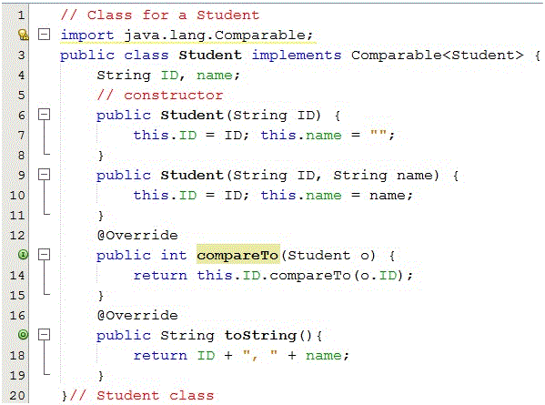  
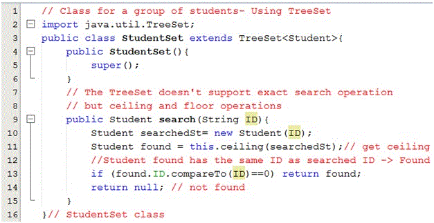  
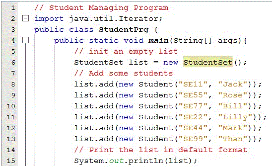  
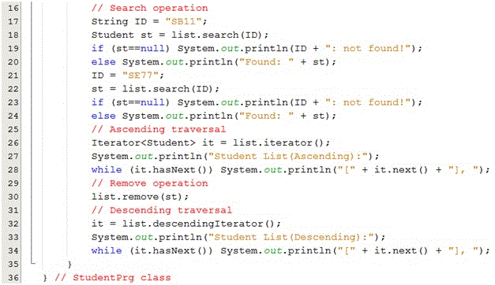  
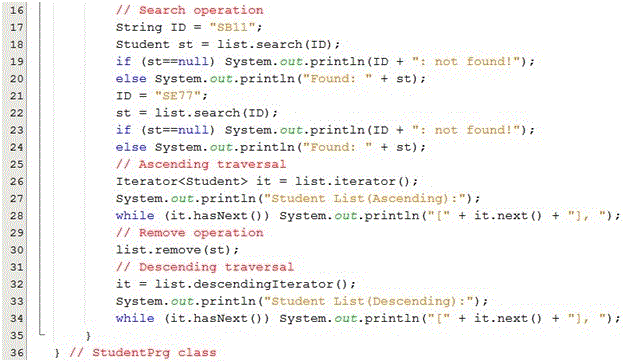  
The output:

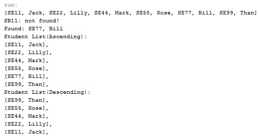

### Map and the java.util.HashMap class

Hashing: A process that will partition a larger set into smaller sub-sets.

The java.util.Map interface doesn’t implement the java.util.Collection interface. A Map combines two collections, called *keys* (the set K) and *values* (the set V). The Map’s job is to associate exactly one value with each key.

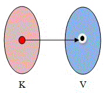

The figure above depicts for a mapping. Each element includes a key and a value. Obj = <K,V>

A Map like a dictionary. Maps check for key uniqueness based on the equals() method, not the == operator. The Key of an object can be a number or a string (such as Student ID, product ID).

A hash-table is a set of subsets but the position index is determined by a function, called a *hash function (h)*. Data of each element include two parts: Key (K) and Value (V). K is unique for each element. The hash function will transform K to a position in the table.  
The mathematical operation, *modulo* (or mod/ % in programming languages C, Java,…) is common used in hash functions.

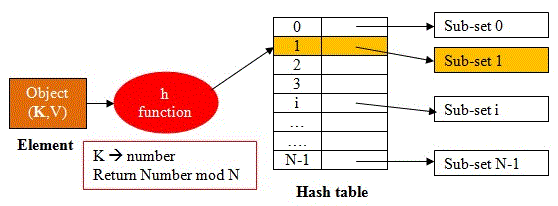

The figure above depicts for a hash function and hash-table.

**Note**: It supports the best way for searching an element because searching in a subset is more efficient than those in a large set.

### Introduction to the java.util.HashMap

A *Hash-table* is based implementation of the Map interface. This implementation provides all of the optional map operations and permits null values and the null key. (The HashMap class is roughly equivalent to Hashtable, except that it is unsynchronized and permits nulls.) This class makes no guarantees as to the order of the map; in particular, it does not guarantee that the order will remain constant over time.

This implementation provides constant-time performance for the basic operations (get and put), assuming the hash function disperses the elements properly among the buckets. Iteration over collection views requires time proportional to the "capacity" of the HashMap instance (the number of buckets) plus its size (the number of key-value mappings). Thus, it's very important not to set the initial capacity too high (or the load factor too low) if iteration performance is important.

[read more HashMap in Javadoc](https://docs.oracle.com/javase/7/docs/api/java/util/HashMap.html)

**Demonstration 1**:  
In this demonstration, an empty hashmap is initiated then some persons (nickName, person) are put and some basic operations on hashmap are performed.

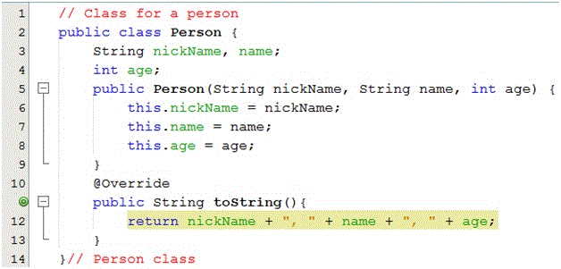

Person objects will be added to a hashtable

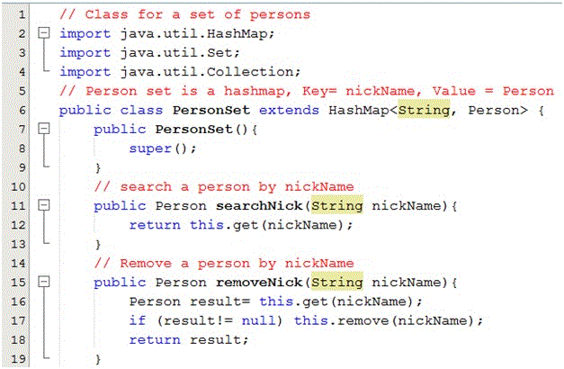  
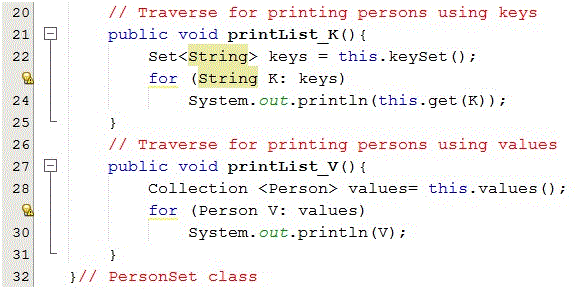  
A hashtable contains Person objects

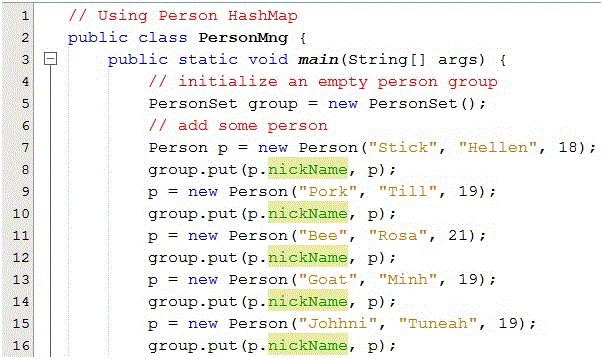  
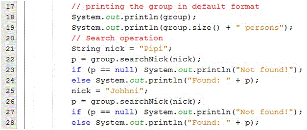  
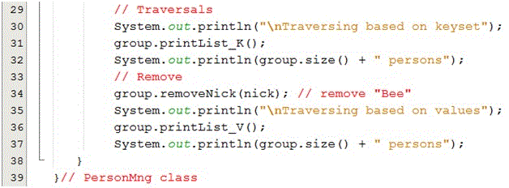

The figures above decribe the way to test the program  
The ouput:

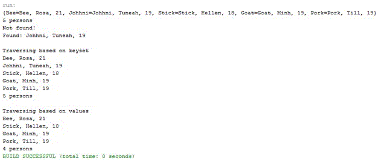

### Using supporting classes in java.util package

Along with the Collections framework, the java.util package also contains supporting classes in which many operations on collections and arrays are implemented. Almost all of these methods are public static. Almost of actions on collections and arrays such as sorting/ shuffling/ copying/ searching/ composition/ finding extreme values(min, max), …were implemented.

Supporting class | Parameter of methods  
--- | ---  
Java.util.Collections | Collection  
Java.util.Arrays | Array  

[read more Collections in Javadoc](https://docs.oracle.com/javase/7/docs/api/java/util/Collections.html)  
[read more Arrays in Javadoc](https://docs.oracle.com/javase/7/docs/api/java/util/Arrays.html)

**Demonstration**: an ArrayList of employees will be sorted with two mechanisms:(1) sorting by ascending ID; (2) Sorting by descending order by salary.

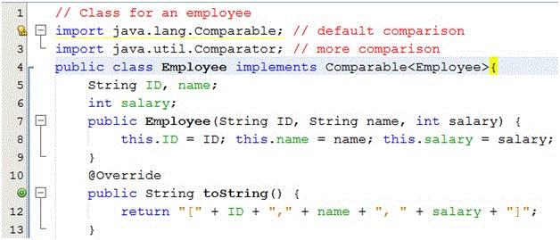  
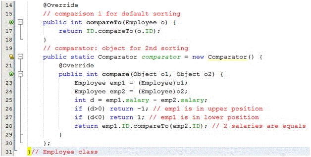  
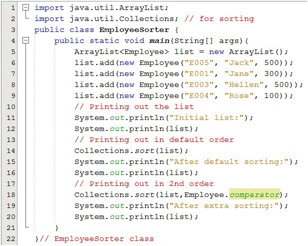

The output:

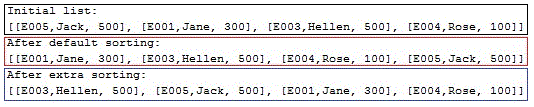

### Summary

- Abstract data type (ADT) is a mathematical model for a data type that is determined based on generalization in which data structure is omitted. In programming languages, an ADT is commonly declared as an interface
- Collection, Set, Map is ADTs
- Java Collections framework, in the java.util package, supports all basic common manipulations on collections, maps, and basic algorithms on collections, arrays are implemented in two supporting classes Collections, Arrays.
- Suggestions for choosing a class for managing a group of elements

Group characteristics | The class should be chosen  
--- | ---  
Elements can be duplicated | Java.util.ArrayList  
Elements must be distinct and sorted and each operation needs high performance. | Java.util.TreeSet  
Each element contains a unique key and operations must have very high performance | Java.util.HashMap  

- For extra operations on collections and arrays such as sorting, copying, …. Refer to classes: java.util.Collections and java.util.Arrays.

### Course Slide

- [Collections.pdf](resource/Collections.pdf)

### Reading

- [Support Classes.pdf](resource/Support classes.pdf)

### Workshop

- Complete the [workshop6](workshop/workshop6.pdf)
