## Encapsulation

### Class and Object

**Class**

In the previous topic, we saw the term “class” but did not give enough consideration to its meaning. Now we can establish a useful definition:

A **class** is an organisational unit of an Object Oriented design and program.

[see class definitions on the w3schools page](https://www.w3schools.com/java/java_oop.asp)  
[see class definitions from other authors](https://open.umn.edu/opentextbooks/textbooks/java-java-java-object-oriented-problem-solving?fbclid=IwAR2_jsAY7ldx2i-178wHimdAkCz0k65ZBVUR7G7OJSNpN3cikA3sPlGQBcQ)

A **key** task in producing an OO design and program is therefore the identification and selection of the most appropriate organisational units. There is no single OO solution for any specific problem, there are just “good” ones and everything else. So we need to establish a set of principles that will help us understand what makes for a “good” choice of an organisational unit or class. We will find that if we choose wisely, our programming task is relatively straightforward. Choose poorly, and our software may be difficult to deliver, hard to maintain and ultimately not a useful solution to our problem - just like an office with poor internal organisation. We can draw on our analysis from the previous section. A good class would exhibit the following characteristics:

- **Highly cohesive:** the class represents a single useful entity or organisational unit and does that job well.
- **Minimally coupled:** the class limits its interactions with other classes to only those that are really necessary for it to do what it is designed to do.
- **Encapsulation:** the class keeps information necessary to its internal operation private and does not expose it to other classes, and only makes public the information.

So whenever we want to create an OO program, we should give thought to the notion of OO design and think about what classes or entities we need to create, using the principles of high cohesion, low coupling and encapsulation as our guide.

A formal definition of a **class** includes two key components: **Fields(Attributes)** and **Methods(Behaviors)**

This is a good time to start.

**Problem:** A sports car can be one of a variety of colours, with an engine power between 100 HP and 200 HP. It can be a convertible or a regular model. The car has a button that starts the engine and a parking brake. When the parking brake is released and you press the accelerator, it drives in the direction determined by the transmission setting.

Design guideline:

1. Step 1: **Looking for main nouns**, classes are often described by main nouns in the problem.
2. Step 2: **Looking for auxiliary nouns** that describe details of the main noun, Fields or Attributes are often described by auxiliary nouns.
3. Step 3: **Looking for verbs**, methods or behaviors are often described by verbs.
4. Step 4: **Find the relationship** among classes. **TIPS**: *If your problem has two main nouns. They have often the relationship.*

Apply the guideline above for the problem

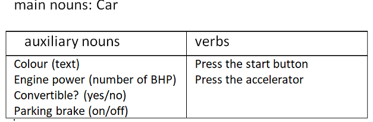

We use Unified Modeling Language(UML) to describe the class structure. UML provides mechanisms to represent class members, such as attributes and methods, and additional information.

Read [this article to get more about UML](https://en.wikipedia.org/wiki/Class_diagram)

A UML class diagram is used to represent the Car class

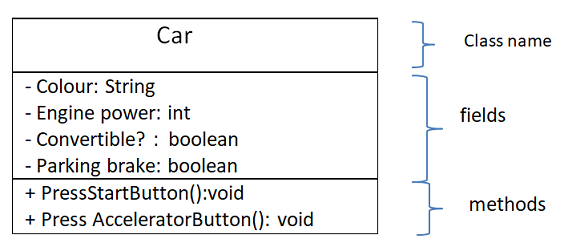

How to draw the class structure?

- put main noun(Car) to make the class name
- put auxiliary nouns(nouns describe the detail of Car) to make fields
- put verbs to make methods
- To specify the visibility of a class member from other classes (i.e. any attribute or method), these notations(-,+,#,~) must be placed before the member's name. (In Java, '~' is replace to ' '). [get more notations](https://en.wikipedia.org/wiki/Class_diagram)

Now, You will implement this class in Java. In your editor, create a new file named Car.java (**Note**: the file named the same as the class name). The code of Car class:

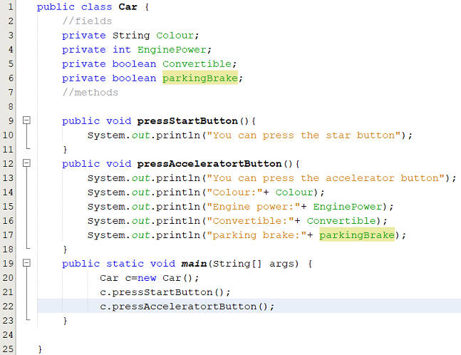  
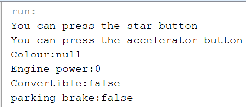

Let's analyze the file Car.java

At line 1, Using **public** keyword to the class Car is visible anywhere in the app. Using the **private** keyword to fields are restricted accessibly from the other classes. When the program compiles and runs, the Java system will perform some steps:

- Step 1: The compiler will generate automatically the method:  
  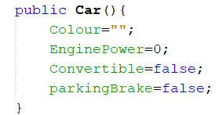  
  and insert into the Car.java. Don't worry about this, later we will discuss it.
- Step 2: Load the Car class definition to static heap. In the figure below, the address **500** is used to store this. The compiler creates also a table that contains all function prototypes and the addressed of the implemented code.
- Step 3: Allocate the space memory for the method main in the stack memory. The reference variable **c** stays in here.
- Step 4: the instruction **new Car()** will be called to allocate the block memory in the dynamic heap( the address **2000** is an example). The block size is based on the Car class definition. Inside, it contains all fields/instance variables that are declared in the Car class and the address of the Car definition. And then, **the Java used the variable c to invoke the method Car()** for assigning **default values** to these fields/instance variables of c. Now, **this block is called to be Object**. The address of the block will is assigned to the vaiable c. c is used to handle the object
- To run **c.pressStartButton();**, the Java system begins from c, gets the address 2000, jumps to 2000, gets the address 500, jump to the table of prototypes, finds the method "pressStartButton", jump to 120 and runs the code. The instruction c.pressAcceleratorButton() is the same. (**Note: all variables in the method pressAcceleratorButton() are fields in the block 2000. Using c to call the method, therefore all fields belong to c.**)


Now, you add more the code to the method main.

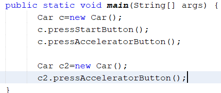  
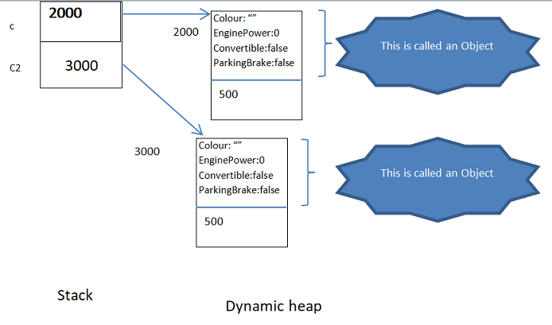  
The code "Car c2=new Car()" creates the second object from the Car class. The second object also contains all fields as the first object. This time, **Java use c2 to inkove the method Car() to assign default values to fields of c2.**  
The line **"c2.pressAcceleratorButton();"** calls the method. Now, all fields in this method belong to c2

**TIPS**: If the reference variable x calls the method then fields in this will belong to x.

### Object

In the example above, we used the keyword **new** to allocate the block memory in the dynamic heap. This block memory ia called the *object* or the *instance* of class. This object is create from the Car class and it contains all fields of this class.

An Object is the block memory in the dynamic heap. An object is create from a class. Using the keyword **new** and follow by the class name. You can create multiple objects from one class

### Why do we have to create objects?

Any program contains also data and tasks. Data in the OO program is showed as objects. Therefore, to the OO program operate, we have to create objects. Through these objects we can invoke or perform tasks

Come back the example above. The first object (at the address 2000) and second object( at the address 3000) are storing the same default values because both c and c2 invoke the template method Car() {...}

### Constructor

Complete encapsulation requires a mechanism for initializing data members at creation-time. Without initialization at creation-time, an object's data members contain undefined values until client code calls a modifier that sets that data.

The special member function that any object invokes at creation-time is called its class' constructor

The example above, the special method **Car(){...}** is inserted to the file Car.java. It is called the **default constructor**. Therefore, all fields of c or c2 are assigned to empty values. Values are called the **state of object**. Initializing an object's instance variables in a constructor ensures that the object has a well-defined state from the time of its creation.

The default constructor takes its name from the class itself. The prototype for this no-argument constructor takes the form **ClassName()**

### Overloading Constructors

Overloading a class' constructor adds communication options for client code. Client code can select the most appropriate set of arguments at creation time.

Add more the code to the Car.java


This method is called the **constructor with parameters**

Add the code to the method main

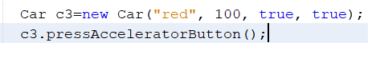

In the above code, the third object c3 is created and c3 invokes the constructor with parameters. All fields of c3 are assigned as {"red", 100, true, true}

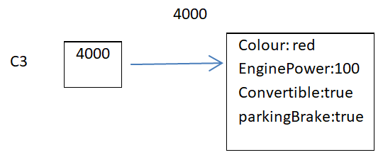 Because c3 inkoves pressAcceleratorButton(), The state of c3 is printed out.

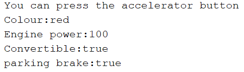

**Note**: If the class definition includes the prototype for a constructor with some parameters but does not include the prototype for a no-argument default constructor, the compiler DOES NOT insert an empty-body, no-argument default constructor. The compiler only inserts an empty-body, no-argument default constructor if the class definition does not declare ANY constructor.

All methods that are implemented in the Car class at the time are called member methods/functions

### The current Object

When run **"c1.pressAcceleratorButton();"**, c1 invokes the method => the object (is handled by c1) is the current object at the time

When run **"c2.pressAcceleratorButton();"**, c2 invokes the method => the object (is handled by c2) is the current object at the time.

**This**

The keyword **this** returns the address of the current object. That is, this holds the address of the region of memory that contains all of the data stored in the instance variables of current object.

**Scope of this:** This is created and used just when the member method is called. After the member method terminates **this** will be discarded

[more](https://www.javatpoint.com/this-keyword)

for example, **c3=new Car("red",100, true, true);**


Upon entering the constructor with parameters, the pointer **this** is created by Java and it is storing the address of the object (4000). **c3 and this** are pointing to the current object . Using **this** in here to distinguish local variable and instance variable/field. After assigning values of input parameters to instance variables of c3, **this** will be discarded

**TIPS**: If parameters (formal arguments) of a member method and instance variables/fields are same. So, we are using this keyword to distinguish local variable and instance variable.

### Member functions

Member functions are the functions, which have their declaration inside the class definition and work on the data members of the class.

At the time, the Car class contains member funtions as:

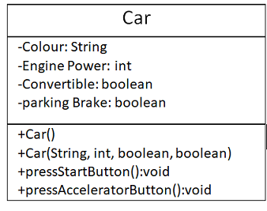

After an object is created and assigned default values. Now, if you want to set one instance variable to other value. for example, change only one instance variable colour of c3 to 'black'. What solution for this case?

It's OK, we will add more a method **setColour()** to the Car class design. The code as:

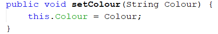

The main code:

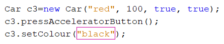

the pointer **c3 invokes setColour("black")**. Therefore, at the time **this.Colour=...** is used to access to instance variable of c3

The same above idea, if you want to get the value of one instance variable you should add more a method **getColour()**

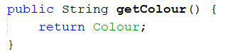

You can also add more other getters/setters. The completed code:

```java
public class Car {
    //fields
    private String Colour;
    private int EnginePower;
    private boolean Convertible;
    private boolean parkingBrake;
    //methods
    public Car(){
        Colour="";
        EnginePower=0;
        Convertible=false;
        parkingBrake=false;
    }

    public Car(String Colour, int EnginePower, boolean Convertible, boolean parkingBrake) {
        this.Colour = Colour;
        this.EnginePower = EnginePower;
        this.Convertible = Convertible;
        this.parkingBrake = parkingBrake;
    }
    
    public void pressStartButton(){
        System.out.println("You can press the star button");
    }
    public void pressAcceleratorButton(){
        System.out.println("You can press the accelerator button");
        System.out.println("Colour:"+ Colour);
        System.out.println("Engine power:"+ EnginePower);
        System.out.println("Convertible:"+ Convertible);
        System.out.println("parking brake:"+ parkingBrake);
    }

    public void setColour(String Colour) {
        this.Colour = Colour;
    }

    public String getColour() {
        return Colour;
    }

    public int getEnginePower() {
        return EnginePower;
    }

    public void setEnginePower(int EnginePower) {
        this.EnginePower = EnginePower;
    }

    public boolean isConvertible() {
        return Convertible;
    }

    public void setConvertible(boolean Convertible) {
        this.Convertible = Convertible;
    }

    public boolean isParkingBrake() {
        return parkingBrake;
    }

    public void setParkingBrake(boolean parkingBrake) {
        this.parkingBrake = parkingBrake;
    }
    
    public static void main(String[] args) {
          Car c=new Car();
          c.pressStartButton();
          c.pressAcceleratorButton();
          
          Car c2=new Car();
          c2.pressAcceleratorButton();
          
          Car c3=new Car("red", 100, true, true);
          c3.pressAcceleratorButton();
          c3.setColour("black");
          System.out.println("Colour of c3:" + c3.getColour());
    }
    
}
```

Output:

```
You can press the star button
You can press the accelerator button
Colour:
Engine power:0
Convertible:false
parking brake:false
You can press the accelerator button
Colour:
Engine power:0
Convertible:false
parking brake:false
You can press the accelerator button
Colour:red
Engine power:100
Convertible:true
parking brake:true
Colour of c3:black
```

**TIPS**: A class often has method four groups. Constructors, getters, setters and other logic methods. Any method that is put in the class will operate on fields in its class.

### Package

A *package* is a namespace that organizes a set of related classes and interfaces. Conceptually you can think of packages as being similar to different folders on your computer.

Because software written in the Java programming language can be composed of hundreds or thousands of individual classes, it makes sense to keep things organized by placing related classes and interfaces into packages.

[see more at Oracle](https://docs.oracle.com/javase/tutorial/java/concepts/package.html)  
[see more at other page](https://www.geeksforgeeks.org/packages-in-java/)

#### Creating a package

To create a package, you choose a name for the package and put a package statement with that name at the top of every source file that contains the types (classes, interfaces, enumerations, and annotation types) that you want to include in the package.

The package statement (for example, *package mypkg;*) must be the first line in the source file. There can be only one package statement in each source file, and it applies to all types in the file.


[read more](https://docs.oracle.com/javase/tutorial/java/package/createpkgs.html)

### Access modifier

To specify the visibility of a class member (i.e. any attribute or method), we use:

- private: -
- public: +
- protected: #
- default: if don't any notation, it is treated as default

these keywords are called **access modifier**

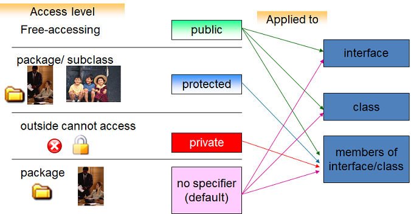

Let's understand the access modifiers in Java by a simple table.


**private:**

The private access modifier is accessible only within the class.

We cut the method main in the file Car.java. Paste it to the other file named Tester.java.

```java
public class Tester {
        public static void main(String[] args) {
          Car c=new Car();
          c.pressStartButton();
          c.pressAcceleratorButton();
          
          Car c2=new Car();
          c2.pressAcceleratorButton();
          
          Car c3=new Car("red", 100, true, true);
          c3.pressAcceleratorButton();
          c3.setColour("black");
          System.out.println("Colour of c3:" + c3.getColour());
          //access the instance variable Colour of c
          c.Colour="Gray"; // error
    }
}
```

In the method main, Using **c.Colour="Gray"** will cause an error because it is private data. Also , all private members can not access from other classes

**public**

The **public** access modifier is accessible everywhere.

In the above example, the Car class is public to can use it everywhere. In the Tester.java, we can also access to public methods.

**default**

If you don't use any modifier, it is treated as default by default. The default modifier is accessible only within package. It cannot be accessed from outside the package. It provides more accessibility than private. But, it is more restrictive than protected, and public.

Edit the file Car.java

```java
package A;
public class Car {
    //fields
    private String Colour;
    private int EnginePower;
    private boolean Convertible;
    private boolean parkingBrake;
    ...
    void pressStartButton(){
        System.out.println("You can press the star button");
    }
}
```

Edit the file Tester.java

```java
package B;
import A.Car;
public class Tester {
        public static void main(String[] args) {
          Car c=new Car();
          c.pressStartButton();        // error
          c.pressAcceleratorButton();
          
          Car c2=new Car();
          c2.pressAcceleratorButton();
          
          Car c3=new Car("red", 100, true, true);
          c3.pressAcceleratorButton();
          c3.setColour("black");
          System.out.println("Colour of c3:" + c3.getColour());
    }
}
```

Because the method **pressStartButton()** is default, in the method main we can not invoke this.

**protected**

The protected access modifier is accessible within package and outside the package but through inheritance only.

[the link to get demo](#)

### Summary

- Encapsulation is a way of packaging data and methods together into one unit. [more](https://www.w3schools.in/java-tutorial/encapsulation)
- To achieve encapsulation, declare fields as private
- Provide public get and set methods to access and update the value of a private variable
- The constructor is a special member function that an object invokes at creation time, the name of the constructor is the name of the class, not have return types
- The compiler inserts an empty body constructor into any class definition that does not declare a constructor
- The current values are storing in instance variables of a object is called the state

### Course Slide

- [Encapsulation.pdf](resource/Encapsulation.pdf)

### Workshop

- Complete the [workshop3](workshop/workshop3.pdf)
