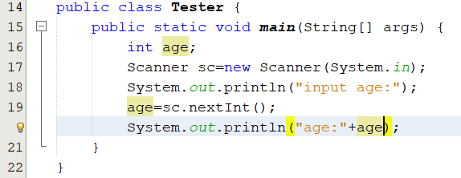
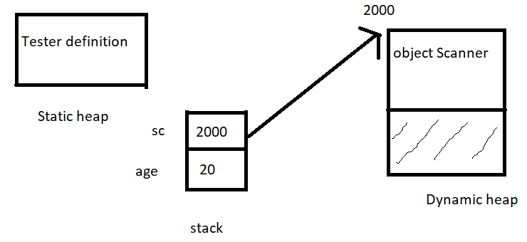
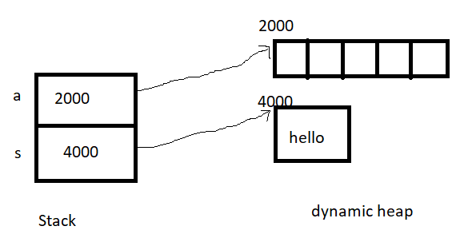
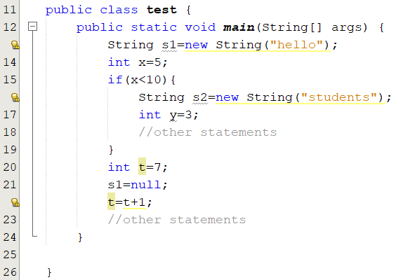

## Memory Management in Java

### Static and dynamic Heap and Stack

In Java, memory management is the process of allocation and de-allocation of objects, called Memory management. Java does memory management automatically. Java uses an automatic memory management system called a garbage collector. Thus, we are not required to implement memory management logic in our application.

*read more* [memory management at docs.oracle.com](https://docs.oracle.com/cd/E13150_01/jrockit_jvm/jrockit/geninfo/diagnos/garbage_collect.html)  
*read more* [memory management at javatpoint.com](https://www.javatpoint.com/memory-management-in-java)

In Java, the process of allocation is done directly when you create an object with the new operation and indirectly when you call a method that has local variables or arguments.

Local data of a method includes return data, parameters, variables are declared in the body of the method.

Local data of a method is allocated space on the **stack** and are discarded when the method exits, but objects are allocated space on the [heap](#heap) and have a longer lifetime.

#### Static and dynamic Heap and Stack

**Static heap** contains class declarations when these classes are loaded. we can have a static method, static class, static block, static variable. How? We can use **static** keyword with methods, variables, class, and blocks.

**Dynamic heap** is the run time data area from which the memory for all java objects and arrays is allocated. The heap is created when the Java Virtual Machine starts up and may increase or decrease in size while the application runs. When an object is not used (garbage), it’s memory can be de-allocated. [more](https://www.betsol.com/blog/java-memory-management-for-java-virtual-machine-jvm/#Heap_Memory)

A Java **stack** is part of your computer’s memory where temporary variables, When a method is invoked, it creates a new block in the stack for that particular method. The new block will have all the local values, as well as references to other objects that are being used by the method. When the method ends, the new block will be erased and will be available for use by the next method. for [detail](https://dzone.com/articles/stack-vs-heap-understanding-java-memory-allocation)

Consider the code



Let's analyze this step-by-step:

1. When the program runs, the class definition **Tester** is loaded to static heap.
2. Upon running the method main, a space in stack memory is create to store variables: age and sc.
   - The value of the variable age is stored directly in stack memory
   - The reference sc is used to point to the object Scanner in the heap memory
3. When the method main finishes, the space on the stack of the method main is discarded. So, the variable age and sc are out of its code, they will are killed.
4. But the object Scanner is allocated on the heap still exists. This object is treated as *garbage*.



### Dynamic Allocation

Consider the code:

```java
public static void main(String[] args){
    int a[]=new int[5];   // [1]
    String s=new String("hello");  // [2]
}
```

When the method main runs, the variable a, s are allocated in the stack memory. The variable a, s are reference ( see again [variable in Java](foundations.html#datatype)).

At [1], the keyword **new** is used to allocate contiguous memory dynamically in the **heap memory** for an array of 5 elements and returns the address of the array's first element. The reference **a** is storing this address.

At [2], the keyword **new** is used to allocate a block memory in the heap to contain the text "hello" and returns the address of this block.



If you do not want the variable a,s point to anything address, you can use the keyword **null**.

```java
int a[]=null;
String s=null;
```

### Dynamic Deallocation

In Java, you never explicitly free the memory that are allocated. instead, Java provides **automatic garbage collection**.

In the example above, local variables in the method main will be allocated when the method main runs and **deallocated automatically** when the method terminates.

Also, unused objects on the heap memory will be deallocated by the Java system.

Consider a complete example,



Scope of a variable begins at the line where it is declared and ends at the closing bracket of the block containing it.

When the program runs to line 19, the variables s2, y are out of scope( they are no longer used) and the String object which was created at line 16 became garbage. This object will is **deallocated automatically garbage collection**

At line 21, the statement **s1=null** will make the String object which was created at line 13 became garbage.

### Garbage Collection

JVM supports the garbage collector in order to free Java programmers from explicitly managing heap.

It is called by JVM only. We can not activate it.

Java heap is managed by 2 lists: Free block list, Allocated block list [read a paper to get more](https://www.oracle.com/technetwork/java/javase/memorymanagement-whitepaper-150215.pdf)

After very much times for allocating and de-allocating memory, fragmented and free blocks are not contiguous.

The runtime system keeps track of the memory that is allocated and is able to determine whether that memory is still useable.

Garbage collector has the lowest priority. It runs only when the system heap becomes exhausted.

If objects are garbage they are deallocated automatically by garbage collector.

[ Garbage Collection in Java](https://www.oracle.com/webfolder/technetwork/tutorials/obe/java/gc01/index.html)

### Summary

- The memory available to an application at run-time consists of static and dynamic heap and stack
- Static memory contains class definitions and shared data of the application
- Java supports the dynamic memory to an application at run-time upon request
- The keyword **new** allocates a region of dynamic memory and returns its starting address
- We store the address of dynamically allocated memory in the reference variable.
- Deallocation is made by Garbage Collector

### Course Slide

- [Memory Management in Java.pdf](resource/Memory Management in Java.pdf)
