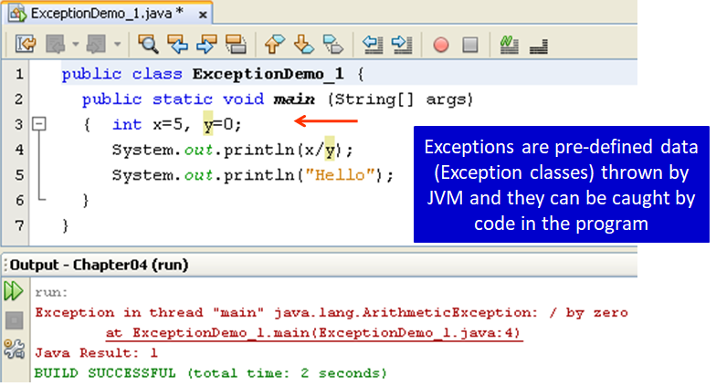
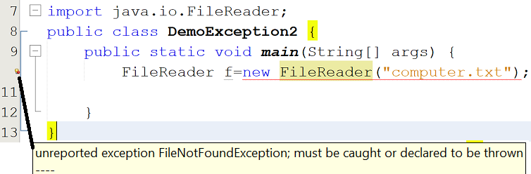
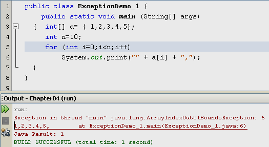
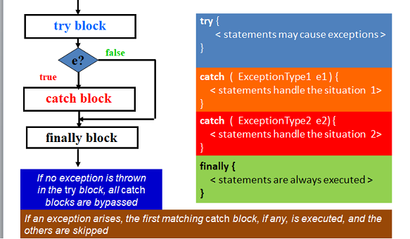
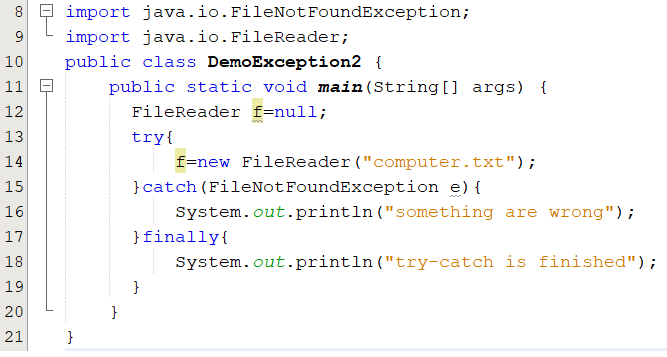
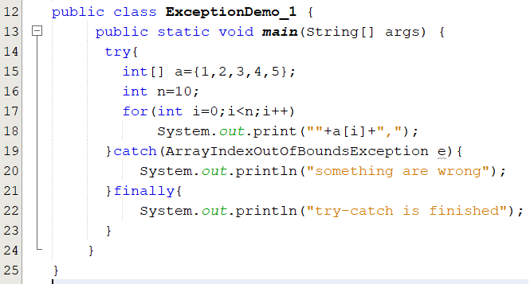
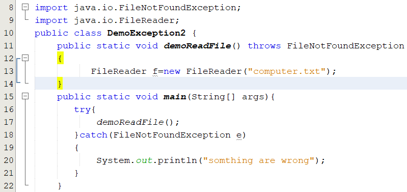
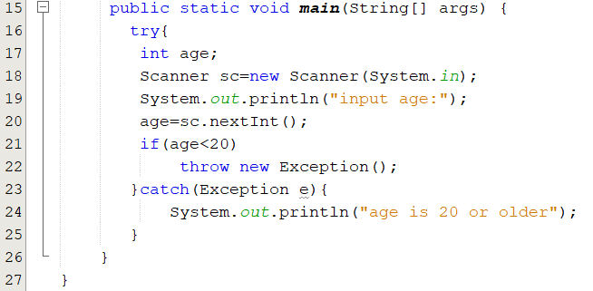
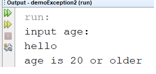
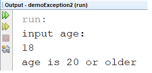

## Exception

### What Is an Exception

An exception is an event, which occurs during the execution of a program, that disrupts the normal flow of the program's instructions.

When an error occurs within a method, the method creates an object and hands it off to the runtime system. The object, called an exception object, contains information about the error, including its type and the state of the program when the error occurred. Creating an exception object and handing it to the runtime system is called throwing an exception.  
[for detail](http://docs.oracle.com/javase/tutorial/essential/exceptions/index.html)

For example:  
a user might type an invalid filename;  
An accessed file does not exist or might contain corrupted data;  
a network link could fail;  
…  

Circumstances of this type are called exception conditions in Java and are represented using objects (All exceptions descend from the java.lang.Throwable).

Consider the code that cause an exception:  
  
At the row 4, the method main causes one error and this method creates an exception object, its type is ArithmeticException. And then JVM will throw it to the method main. Because the method main we do nothing to control this error, the output looks like this.

When the error occurs at the row 4, the statement at the row 5 is dismissed.

### Kinds of Exception

**Checked exception**

Checked exceptions are the exceptions that are checked at compile time. You must be handled by either the try-catch mechanism or the throws-declaration mechanism.

*for example:*  
  
In the above example, the method FileReader() is throwing an exception to here. So, you must use try-catch mechanism or throws mechanism to handle.

**Unchecked exception**

An unchecked exception is an exception that occurs at the time of execution. These are also called as Runtime Exceptions. The program won’t give a compilation error. Most of the times these exception occurs due to the bad data provided by user during the user-program interaction.

*for example:*  
  
If you have declared an array of size 5 in your program, and trying to call the 6th element of the array then an error occurs.

[for detail](https://stackify.com/types-of-exceptions-java/)

### How to fix

We can use try-catch mechanism or throws mechanism to handle to avoid this error.

**try-catch mechanism**

Consider the flow and syntax:  
  
The *try* statement allows you to define a block of code to be tested for errors while it is being executed.

The *catch* statement allows you to define a block of code to be executed, if an error occurs in the try block.

The *finally* statement lets you execute code, after try...catch, regardless of the result

Note: You cannot use finally without a try block. the Finally block is optional

In the example **DemoException2**, we will edit  

When the program runs to the row 14, if the file name "computer.txt" does not exist then an exception object is created(its type is FileNotFoundException) by the method main and JVM will throw the object to catch block, the variable e is used to store the address of the object. In the catch block, you can use the variable a to get error information.

**The Output will be :**  
something are wrong  
try-catch is finished

In the example **ExceptionDemo_1**, we will edit  

When you try to get 6th elements, an exception object is created(its type is ArrayIndexOutOfBoundsException). JVM will throws the object to catch block.

**The output will be:**  
1,2,3,4,5,something are wrong  
try-catch is finished

**throws mechanism**

In the example **DemoException2**, the error occurs in the main, to fix a checked exception we use **throws** keyword. We will edit:  

**The output will be:** something are wrong if the file name "computer.txt" does not exist.

### Examples

The code below to print out "age is 20 or older" if age is below 20 or input a text.

When the code runs to the row 20, if you input a text "hello" then this method will create an exception object and JVM will throw it to the catch block to handle. The output will be:  

If you input 18 then the statement **throw new Exception()** will create an exception object. This object will be thrown to the catch block. The output will be:  

### Summary

- A try block is always followed by a catch block, which handles the exception that occurs in associated try block.
- A single try block can have multiple catch blocks associated with it. see [catching multiple exceptions in java.](https://docs.oracle.com/javase/7/docs/technotes/guides/language/catch-multiple.html)
- A try statement may be nested inside either the try or catch block of another try statement. see [Nesting of try/catch Blocks](https://beginnersbook.com/2013/04/nested-try-catch/#:~:text=When%20a%20try%20catch%20block,that%20that%20catch%20block%20executes.)
- When you write a method that causes an exception. If you do not want to handle this error you can throw it to another method to handle the error by using throws keyword
- You can create your own exception Classes, see [Custom Exception Classes](https://www.javatpoint.com/custom-exception)

### Course slide

- [Exceptions.pdf](resource/Exception Handling.pdf)

### Workshop

- Complete the [workshop2](workshop/workshop2.pdf)
