## Foundations

### Java Virtual Machine

The Java Virtual Machine is an abstract computing machine. Like a real computing machine, it has an instruction set and manipulates various memory areas at run time. It is reasonably common to implement a programming language using a virtual machine; the best-known virtual machine may be the P-Code machine of UCSD Pascal [see Wiki for a detailed exposition](http://en.wikipedia.org/wiki/Java_virtual_machine).

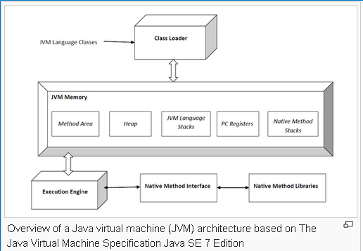

### Java Platform

A platform is the hardware or software environment in which a program runs.  
The Java platform has two components:
- The Java Virtual Machine
- The Java Application Programming Interface (API)

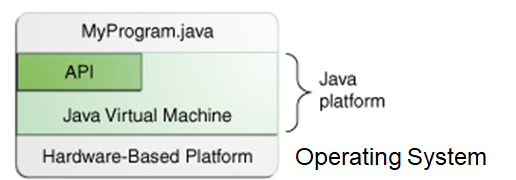

### The first Java program in the NetBeans

This program will show the string “Hello World” to the screen.  
Steps:
1. Create a new Java NetBeans project
2. Add a Java class
3. Write code
4. Compile/Run the program

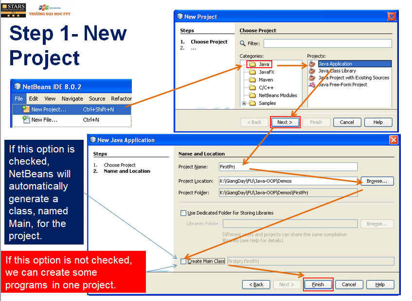  
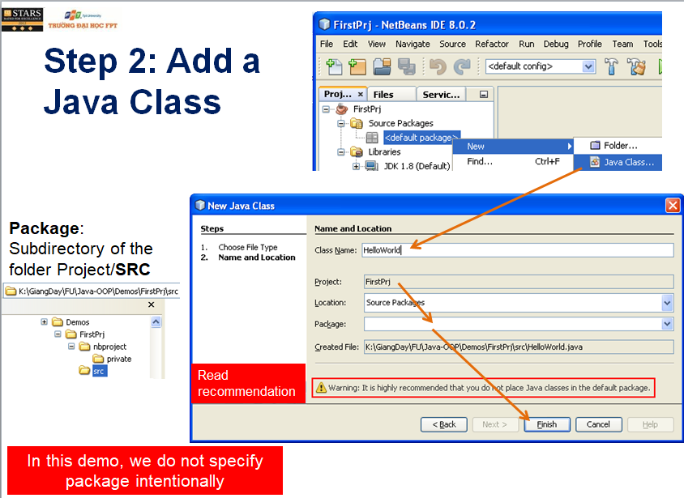  
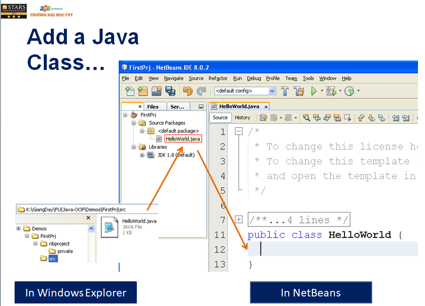  
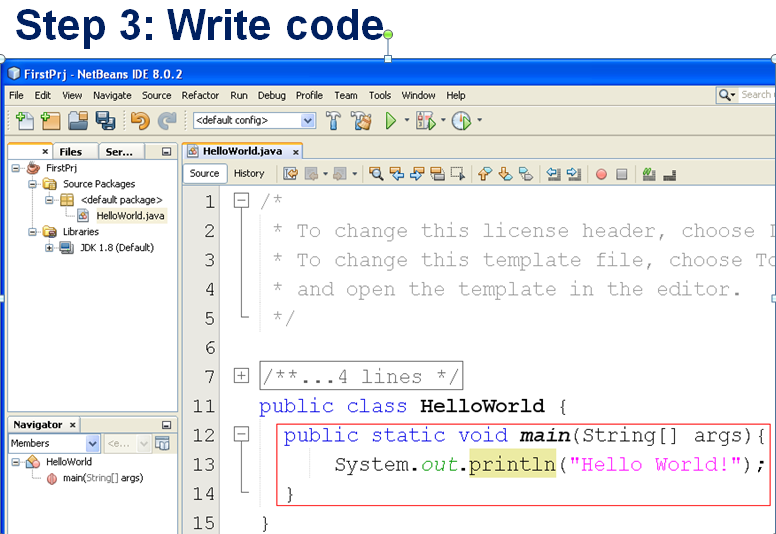  
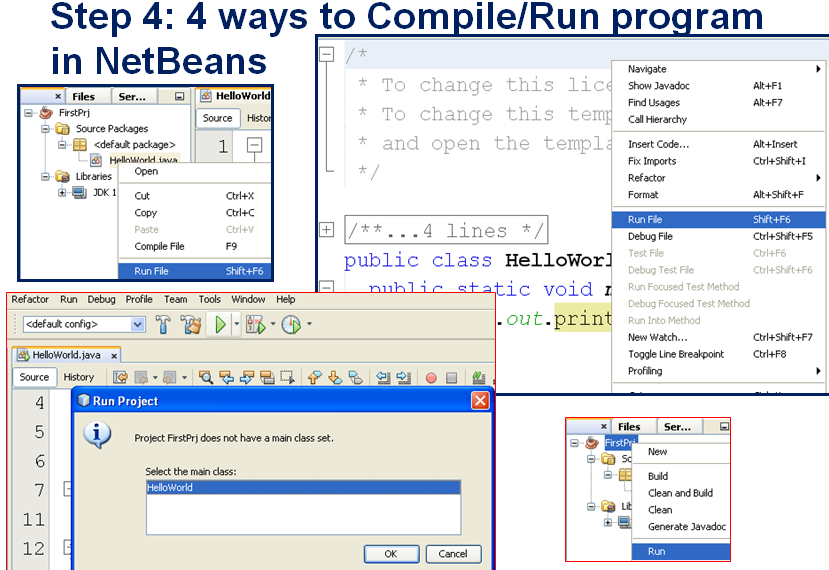

### Keywords and Identifiers

Keywords: Almost of them are similar to those in C language  
Naming Convention:  
  
Java is a case-sensitive language  
Identifiers must be different to keywords

### Data Type

The types of the Java programming language are divided into two categories: primitive types and reference types

#### Primitive Type

A primitive is a simple non-object data type that represents a single value. Java’s primitive data types are:  
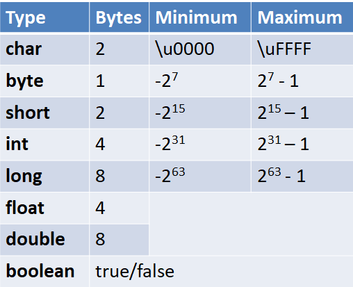

**Declaration**  
```java
Type var [=Initial value];
```
for example:  
```java
int RollID;
char type='A';
```
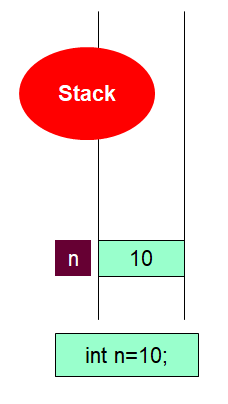

#### Reference Type

Following are the reference types in Java.

- **Class** types − This reference type points to an object of a class.
- **Array** types − This reference type points to an array.
- **Interface** types − This reference type points to an object of a class which implements an interface.

Once we create a variable of these types (i.e. when we create an array or object, class or interface). These variables only store the address of these values. Default value of any reference variable is null. A reference variable can be used to refer any object of the declared type or any compatible type.

for example:  
```java
String s=new String("Hello");
```


```java
int[] ar;
ar= new int[3];
ar[0]=1; ar[1]=2; ar[2]=3;
```
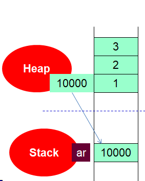

### Scope

The scope of a declaration is the portion of a program over which that declaration is visible. Scopes include:

- function scope - visible to the source code within the function
- class scope - visible to the member functions of the class
- block scope - visible to the code block
- global scope - visible to the entire program
- file scope - visible to the source code within the file

The scope of a non-global declaration begins at the declaration and ends at the closing brace for that declaration. A non-global declaration is called a local declaration.

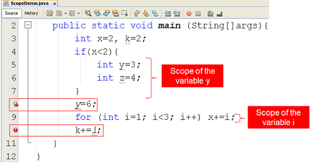

### One Dimensional Arrays

An array is a container object that holds a fixed number of values of a single type.  
The length of an array is established when the array is created.  
Each item in an array is called an element, and each element is accessed by its numerical index.

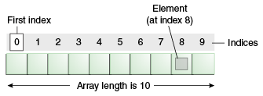

**Declaration**  
```java
int[] ar;  // for detail click here
float anArrayOfFloats[];
```

**Creating, Initializing, and Accessing an Array**  
```java
int[] anArray = new int[10];
```
You can use the arraycopy method from System class to copy an array to another array.

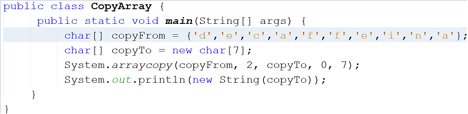  
output: *caffein*  
In the above example, we copy the array *copyFrom*, beginning at the specified position *2*, to the specified position *0* of the array *copyTo*. The number of components copied is *7*.

### Multiple Dimensional Arrays

Consider the example:  
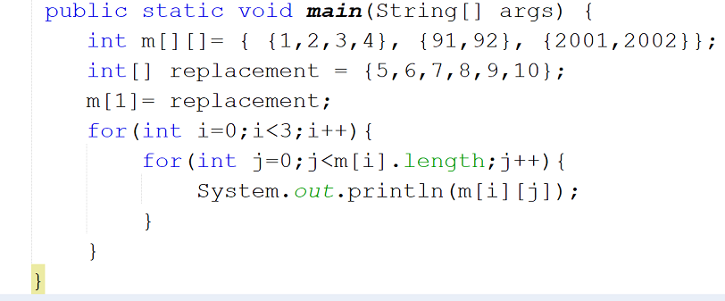  
This is a sample memory map of the above code  
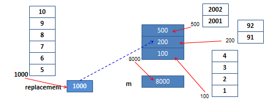  

we have created a multidimensional array named *m*, it holds 8 elements. The variable m is storing the value: *8000* that is the address of an array. m can be seen as an array of one–dimensional array.  
In the above example, the statement: m[1]=replacement to assign 1000 to m at index 1.  
Now, the m can hold 12 elements.  
output: *1,2,3,4,5,6,7,8,9,10,2001,2002*

### Operators

  
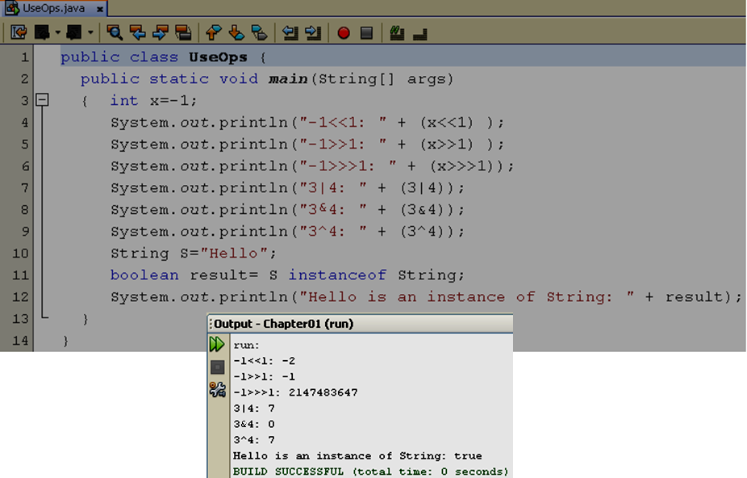  
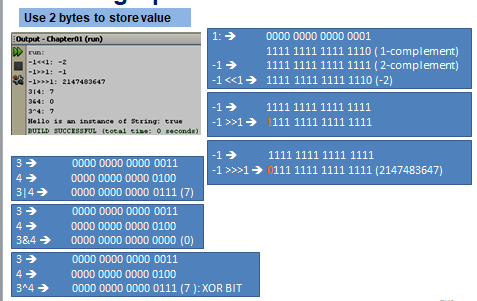

[for detail click here](https://docs.oracle.com/javase/tutorial/java/nutsandbolts/operators.html)

### Logic constructs

The statements inside your source files are generally executed from top to bottom, in the order that they appear. Control flow statements, however, break up the flow of execution by employing decision making, looping, and branching, enabling your program to conditionally execute particular blocks of code. This section describes the decision-making statements (if-then, if-then-else, switch), the looping statements (for, while, do-while), and the branching statements (break, continue, return) supported by the Java programming language.

- if statement [for detail](https://docs.oracle.com/javase/tutorial/java/nutsandbolts/if.html)
- switch statement [for detail](https://docs.oracle.com/javase/tutorial/java/nutsandbolts/switch.html)
- while, do, for statements [for detail](https://docs.oracle.com/javase/tutorial/java/nutsandbolts/while.html)

### Summary

- a declaration associates an identifier with a type
- a definition attaches meaning to an identifier and is an executable statement
- the scope of a declaration is that part of the program throughout which the declaration is visible
- The types of the Java are primitive types and reference types

### Course Slide

- [Learning the Java Language.pdf](resource/Learning the Java Language.pdf)

### Reading

- [Download & Install JDK & NetBeans 8.pdf](resource/Download & Install JDK & NetBeans 8.pdf)
- [How to compile and run a Java program.pdf](resource/Get start.pdf)
- [Number and String in Java.pdf](resource/Numbers and Strings.pdf)
