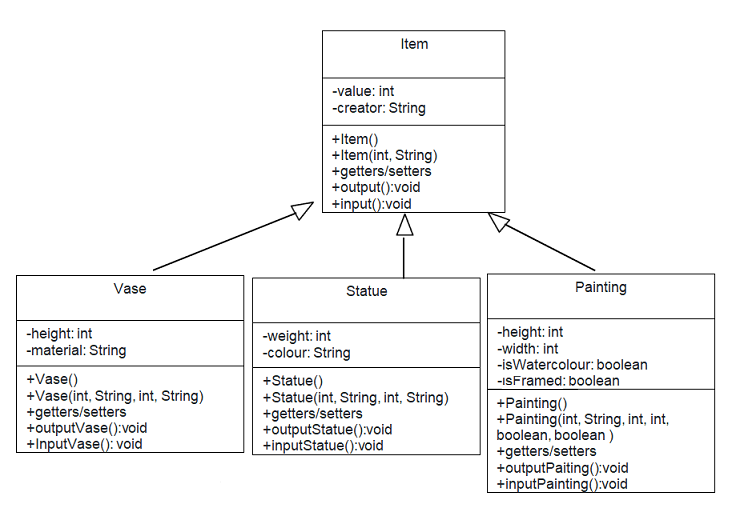
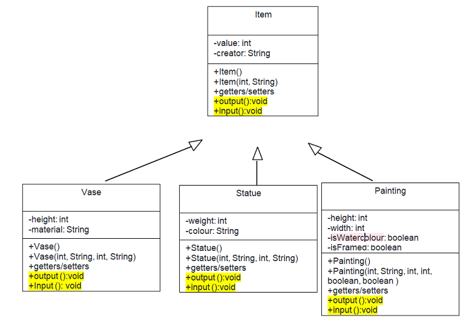
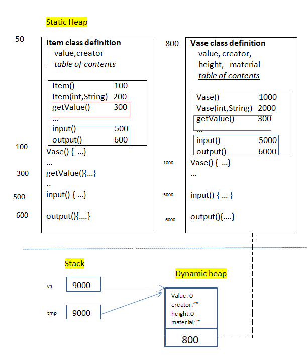
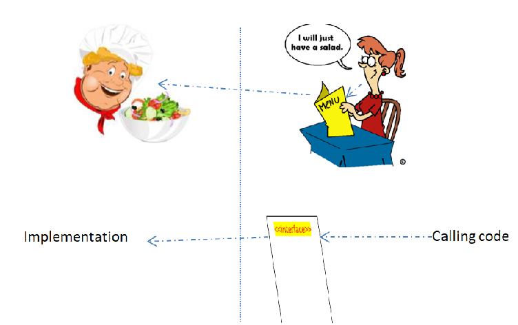

## Polymorphism

### Overloading & Overriding

In previous topic, we have explored the idea that classes can appear in many forms. But the concept of polymorphism does not end there. This topic will explore the term "Polymorphism".

**Definition**: Methods can also appear in many different forms.

The ability allows many versions of a method based on overloading and overriding methods techniques.

**Overloading**: A class can have some methods which have the same name but their parameter types are different.

**Overriding**: A method in father class can be overridden in its derived classes (body of a method can be replaced in derived classes).

#### Overloading

Overloading addresses variations in a function's signature. Overloading allows binding of function calls with the same identifier but different argument types to function definitions with correspondingly different parameter types. It is a syntactic abbreviation that associates the same function identifier with a variety of function definitions by distinguishing the bindings based on function signature. The same function name can be used with a variety of unrelated argument types. Each set of argument types has its own function definition. The compiler binds the function call to the matching function definition.

Back our AntiqueShop example, a good example here would be a constructor method. The job of a constructor method is to initialise an object. Depending on what data is available at the time the object is created, it may need to be initialised in different ways. More than one constructor can be created to deal with the different scenarios. They must all carry the same method name as their class, or they would not be categorised as constructor methods But they will need to differ in the pattern and/or number of formal parameters so that the compiler can work out which of the constructors is the correct one to call.

Consider constructors in the Vase class.

```java
public class Vase extends Item
{ 
    private int height;
    private String material;

    public Vase(){    
         super();
         height=0;
         material="";
    }
    public Vase(int height, String material){
        super();
        this.height=height;
        this.material=material;
    }
    public Vase(int value, String creator, int height, String material){
         super(value, creator);
         this.height=height;
         this.material=material;
    }
    ...
} 
```

We say that the Vase constructor method is polymorphic as it appears in three forms. We can describe the form using the method signatures:

```
Vase();
Vase(int , String );
Vase(int , String , int , String );
```

When we instantiate instances of the Vase object, the compiler will look for a matching constructor signature. Each signature must be unique or the compiler will report an error. If the compiler cannot locate a matching signature, it will report an error. So in our AntiqueShop class, we now have two options to creates Vase objects:

```
...
Vase v1 = new Vase(0,"Dave", 50, "bronze");
Vase v2 = new Vase(100,"plaster");
...
```

Method polymorphism also extends to general methods. We can have as many alternative implementations of a method as we like as long as they are all unique in their signature of formal parameters. Note that uniqueness by returned value type alone is not sufficient.

We could create two trimPainting() methods in our Painting class:

```java
public class Painting extends Item
{ 
    private int height;
    private int width;
    public boolean isWatercolour;
    public boolean isFramed;

    ...
    public void trimPainting()
    {
        width -= 1;
    }
    public void trimPainting(int amount)
    {
        width -= amount;
    }
} 
```

The first version is for when we have not been given a value for the amount to reduce the width, and thus use a default value of 1. The second can be used where we have been given an amount to reduce the width by.

#### Overriding

Overriding addresses the multiplicity of definitions available for a function call. Overriding allows the multiplicity of member function definitions by selecting the definition from the set of definitions based on the object's type. The type is a type that belongs to an inheritance hierarchy. All member function definitions share the same name throughout the hierarchy.

In the workshop4, we have implemented as follows:



For now, we know that the Item superclass and the Vase subclass have the same task that is to get values from the user to assign to them fields. It is not good OO design, when we put the *input* method in the Item class and the *inputVase* method in the Vase class.

There are some reasons as follows:

- Methods have the same purpose they should be named the same.
- To reduce explicit casting when we need to call methods of subclasses in the [dynamic type](inheritance.html#casting).

How to get a good OO design?

We edit the class diagram as follows:



In the above diagram, the *input/output methods* in the father class can be **overridden** in its derived classes (body of a method can be replaced in derived classes).

```java
public class Item
{
    protected int value;
    protected String creator;
    ...
    public int getValue(){
         return value;
    }
    public void input()
    {
        Scanner sc=new Scanner(System.in);
        System.out.println("enter a value:");
        value=sc.nextInt();
        System.out.println("enter a creator:");
        creator=sc.nextLine();
    }
    public void output()
    {
        System.out.println("enter a value:" +value);
        System.out.println("enter a creator:" + creator);
    }
      
} 
```

```java
public class Vase extends Item
{ 
    private int height;
    private String material;

    ...
    @Override
    public void input()
    {
        super.input();      //call the input method version of the father class
        Scanner sc=new Scanner(System.in);
        System.out.println("enter a height:");
        height=sc.nextInt();
        System.out.println("enter a material:");
        material=sc.nextLine();
    }
    @Override
    public void output()
    {
        super.output();   //call the output method version of the father class
        System.out.println("enter a value:" +value);
        System.out.println("enter a creator:" + creator);
    }
      
} 
```

Use the **@Override annotation** that instructs the compiler that you intend to override a method in the superclass (you may not use it because overriding is the default in Java).

The main method, we use the input/output methods

```java
public class AntiqueShop
{ 
    public static void main(String[] args){
    
        Vase v1 = new Vase();
        v1.input();
        v1.output();
        System.out.println("value of v1:" + v1.getValue());

        Item tmp=v1;
        System.out.println("value of tmp:" + tmp.getValue());
        tmp.input();
        tmp.output();    
    } 
} 
```

#### How can overridden methods be determined?

The below figure describes the memory map when the code runs.  


Observe the above figure, the Vase class inherits the getValue() method of the Item class. Therefore, the function prototype *"getValue() 3000"* is copied to the table of contents of the Vase class. The input/output method in the Item class is overridden in the subclass, so other version is put in the table of contents of the Vase class.

The *v1* object is pointing to the *9000* address that contains all fields and the address of Vase class definition *800*. At the time *v1.input()* is run, Java finds v1 in the stack, jumps to address 9000, reads address 800, jumps to Vase class definition, finds the input method in the table of contents, get address 5000, jump to code at 5000 (the method of the Vase class).

When *v1.getValue()* is run, Java finds the getValue() in the table of contents at the address 800, jump to the address 300 where implements getValue of the superclass.

Because tmp is pointing to the v1 object, so *tmp.input()* is a version of the Vase class.

**Rule**: If you are overriding any method, overridden method (i.e. declared in subclass) must not be more restrictive. [read more](https://www.javatpoint.com/access-modifiers#accessoverriding)

### FUNCTION BINDINGS

The compiler binds a function call to a function definition using an object's type. The object's type determines the member function to call in the inheritance hierarchy.

The binding of a member function can take either of two forms:

- static binding - based on the object's static type. It occurs at compile time.
- dynamic binding - based on the object's dynamic type. The method call is bonded to the method body at runtime.

In above code, the *getValue* method implementation is determined/known at compile time. The input method implementation only is determined at runtime.

### Class Object

Class **Object** is the root of the class hierarchy. Every class has Object as a superclass. All objects, including arrays, implement the methods of this class. The Object’s toString() method returns a string consisting of the name of the class of which the object is an instance, the at-sign character `@`, and the unsigned hexadecimal representation of the hash code of the object.

We edit the main method in the AntiqueShop to call the toString method

```java
public class AntiqueShop
{ 
    public static void main(String[] args){
    
        Item tmp = new Item();
        System.out.print(tmp.toString());
        System.out.print(tmp);
    } 
} 
```

The output:  
```
Item@12543  Item@12543
```

[read more](https://docs.oracle.com/javase/7/docs/api/java/lang/Object.html#toString())

**TIPS**: It is recommended that all subclasses override this method. The result should be a concise but informative representation that is easy for a person to read

```java
public class Item{
    
    @Override
    public String toString(){
         return  value + "-" + creator;
    }
}    
public class AntiqueShop
{ 
    public static void main(String[] args){
    
        Item tmp = new Item(1000,"Paris");
        System.out.print(tmp.toString());
        System.out.print(tmp);
    } 
} 
```

Because the Item class overrides the toString method from the Object superclass. So, the output will be

```
1000-Paris  1000-Paris
```

### Abstract Class

We have previously discussed that super classes tend to be more abstract in their nature than the more concrete sub classes. The abstract nature is a reflection of the fact that they are OO design constructs intended as a means of avoiding code duplication, and of modelling some real-world problem domain in a more reflective manner.

In the Antique shop example, now we want to add more a new method named *displayPrice*, by design we want it is the common method to all classes. We will put it into the Item class, so all subclasses can inherit. The task of this method to print out the price of Item based on width, height, or weight fields. But, when you implement it in the Item class, *this class is not able to support any fields as: width, height, or weight*. *This is where we meet the notion of an abstract method.*

**An abstract method**: is a signature definition of a method but with no implementation. The implementation of the method falls to any class that extends the class that defined the abstract method.

First, let’s add the definition of the abstract method to Item:

```java
public abstract class Item
{ 
    protected int value;
    protected String creator;
    ....
    public abstract void displayPrice(); 
    //it is abstract because we lack information to implement.  
    ...         
} 
```

Note also the addition of the **abstract** keyword in the class definition itself. The Item class has become an abstract class.

**An abstract class** is a class that contains one or more abstract method definitions.

We turn to the sub classes. they extend Item, they inherit the *abstract* definition of the *displayDetails()* method. They are now required to provide a concrete implementation of that method. The compiler will not regard the sub class definitions as complete until they provide such a concrete implementation. So, using the Vase class as an example:

```java
public class Vase extends Item
{ 
    private int height;
    private String material;

    ...
    public void displayPrice()
    {
        if(height<100)
           System.out.println("The price is " +  1000 +"$");
        else
           System.out.println("The price is " +  2000 +"$");   
    }
}
```

We are obliged to similarly equip the Statue and Painting sub classes:

```java
public class Statue extends Item
{ 
    private int weight;
    private String colour;

    ...
    public void displayPrice()
    {
        if(weight<100)
           System.out.println("The price is " +  2000 +"$");
        else
           System.out.println("The price is " +  3000 +"$");   
    }
}
```

```java
public class Painting extends Item
{ 
    private int width;
    private int height;
    private boolean isWaterColour;
    private boolean isFramed;

    ...
    public void displayPrice()
    {
        if(width<100 && height<100)
           System.out.println("The price is " +  5000 +"$");
        else
           System.out.println("The price is " +  5000 +"$");   
    }
}
```

**Rule**: A sub class is only complete once it has provided concrete implementations of all abstract methods inherited from its parent super class/classes.

**Rule**: Abstract classes cannot be instantiated

[For other abstract class explanation, see the link](https://www.techopedia.com/definition/17408/abstract-class#:~:text=Definition%20-%20What%20does%20Abstract%20Class%20mean?%20In,Abstract%20classes%20are%20useful%20when%20creating%20hierarchies)

### Interfaces

Objects define their interaction with the outside world through the methods that they expose. Methods form the object's interface with the outside world.

*for example*: The buttons on the front of your television set, the buttons are the interface between you and the electrical wiring on the other side of its plastic casing. You press the "power" button to turn the television on and off. [see more](https://docs.oracle.com/javase/tutorial/java/concepts/interface.html)

Some OO languages, notably C++, support the notion of multiple inheritance whereby a class can inherit attributes and methods from more than one parent class. This can lead to some challenges where attributes and methods of the same name are to be inherited from different places. *Java only permits inheritance from one direct parent class*. However, there are situations where it is desirable to able to take on responsibilities from other classes. This is achieved through the concept of an *interface*.

As the name suggests, an interface provides a single consistent specification of some functionality that a class is intended to provide. A Java interface can *only contain method signatures and fields*. It cannot, in general, contain an implementation of the methods. This makes an interface look like an abstract class where all of the methods are abstract. A class can then opt to implement the interface. The implementing class is then obliged to provide a concrete implementation of the interface methods.

An interface is a reference type that can contain **only constants, initialized fields,  static methods, prototypes (abstract methods), default method, and nested types**.

[ read more: static methods, default method]

In real world, Interfaces look like:



- A customer/calling code will interact with the menu/interface to accomplish something.
- A chef/called code/implementation code will perform this requirement.

In Java, we will create an interface as follows:

```java
public interface Menu
{ 
    public int unitPrice=10;
    public void getSalad();
    public void getBeefsteak();
}
```

Consider the above code, the menu contains two methods that user can call, without any information about how it does what it does. The methods have no body to them. That's because we're leaving the body's definition to the implementing class.

The Chef class will implement these methods

```java
public class Chef implements Menu
{ 
    private String name;
    ....
    public void getSalad(){
       System.out.println("This is a salad");
    }
    public void getBeefsteak(){
        System.out.println("This is a beefsteak");
    }
}
```

```java
public class Tester
{ 
    public static void main(String[] args){
        Menu m=new Chef();
        m.getSalad();
        m.getBeefsteak();
   } 
}
```

Now, it's polymorphism feature. When you instantiate the Chef class, you can assign it to a variable declared as an Menu (an Interface type) rather than Chef (a class type).

### Why And When To Use Interfaces?

- It will be the core of some classes
- Java does not support "multiple inheritance" (a class can only inherit from one superclass). However, it can be achieved with interfaces, because the class can implement multiple interfaces. Note: To implement multiple interfaces, separate them with a comma (see example below). [ refer to w3school]

### Multiple Interfaces

```java
public interface VIPMenu
{ 
    public int unitPrice2=100;
    public void getSalmon();
    public void getFishEggs();
}
```

```java
public class Chef implements Menu, VIPMenu
{ 
    private String name;
    ....
    public void getSalad(){
       System.out.println("This is a salad");
    }
    public void getBeefsteak(){
        System.out.println("This is a beefsteak");
    }
    public void getSalmon(){
      System.out.println("This is a salmon meal");
    }
    public void getFishEggs(){
      System.out.println("This is a fish eggs");
    }
}
```

```java
public class Tester
{ 
    public static void main(String[] args){
        Menu m=new Chef();
        m.getSalad();
        m.getBeefsteak();

        VIPMenu m2=new Chef();
        m2.getSalmon();
   } 
}
```

**Notes on Interfaces:**

- Like abstract classes, interfaces cannot be used to create objects
- Interface methods do not have a body - the body is provided by the "implement" class
- On implementation of an interface, you must override all of its methods
- Interface methods are by default abstract and public
- Interface attributes are by default public, static and final
- An interface cannot contain a constructor (as it cannot be used to create objects)
- An interface can extend other interface

Links to get more [Nested classes] [Local Classes] [Anonymous classes]

### Summary

- Polymorphism is a concept of object-oriented programming
- Polymorphism is the ability of an object to take on many forms
- Overloading and overriding are a technology to implement polymorphism feature.
- In OOP occurs when a parent class/ interface reference is used to refer to a child class object

### Course Slide

- [Polymorphism.pdf](resource/Polymorphism.pdf)

### Workshop

- Complete the [workshop5](workshop/workshop5.pdf)
